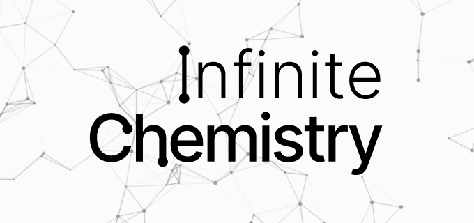

# Infinite Chemistry



Infinite Chemistry is an open-source chemistry stoichiometry and nomenclature educational tool, inspired by [Infinite Craft](https://neal.fun/infinite-craft/). Designed for students, it provides an interactive way to learn how chemical elements bond to form compounds.

## How This Game Works

Using simple **drag-and-drop** mechanics, you can combine elements from the periodic table to discover new chemical compounds.

Example:

- Drag **Nitrogen (N)** onto **Oksigen (O)** to form **Nitrogen Oksida (NO)**.
- All element and compound names are currently localized in **Indonesian** to support local education.

## Key Features

- **Dynamic Bonding Logic:** Real chemistry rules governing ionic and covalent bonds.
- **Interactive UI:** Smooth drag-and-drop interface powered by Vue 3.
- **Atmospheric Background:** Dynamic particle system for a "chemical soup" feel.
- **Indonesian Localization:** Tailored for the Indonesian education system.

## Tech Stack

- **Core:** [Vue 3](https://vuejs.org/) (Composition API)
- **Build Tool:** [Vite](https://vitejs.dev/)
- **Styling:** [Tailwind CSS](https://tailwindcss.com/)
- **Interactivity:** [Vue3-DnD](https://vue3-dnd.netlify.app/)
- **Visuals:** [particles.js](https://vincentgarreau.com/particles.js/) (Customized)

## Getting Started

To run this project locally:

1. **Clone the repository:**
   ```bash
   git clone https://github.com/daniswastaken/infinite-chemistry.git
   ```
2. **Install dependencies:**
   ```bash
   npm install
   ```
3. **Run the development server:**
   ```bash
   npm run dev
   ```

## Project Structure

- `src/components/`: Vue components (Main container, element cards, etc.)
- `src/utils/chemistryEngine.ts`: The core logic for element bonding.
- `src/assets/`: Styling (CSS) and media assets (Images, Sound).
- `public/`: Static assets including `particles.js` configuration.

## Credits & Attribution

- **Original Concept:** Inspired by [Infinite Craft](https://neal.fun/infinite-craft/) by [Neal Agarwal](https://neal.fun/).
- **SFX Assets:** Sourced from the original Infinite Craft for educational prototyping purposes.

## License

This project is open-source and available under the [MIT License](LICENSE).

## Disclaimer

This is a non-commercial educational project built to help students learn chemistry stoichiometry and nomenclature in a fun, interactive way.
